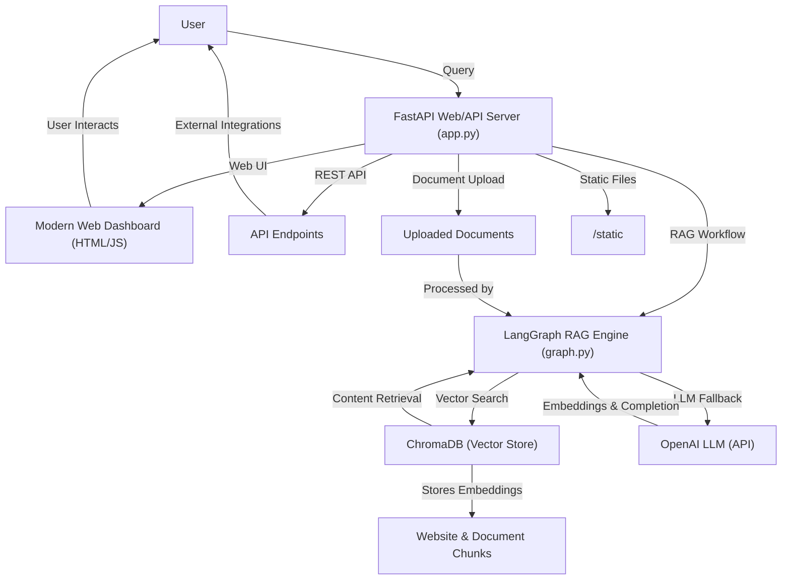

# acorre-langgraph: RAG Website & Document Assistant

## 🌟 Project Overview

acorre-langgraph is a modern Retrieval-Augmented Generation (RAG) system that empowers you to:
- **Scrape and index website content**
- **Upload and search documents (PDF, TXT, HTML, XML, Markdown, CSV, Excel)**
- **Ask questions and get context-aware answers**
- **Seamlessly fall back to OpenAI LLM for general knowledge**

It features a beautiful web dashboard, robust REST API, and CLI/demo scripts for flexible integration and experimentation.

---

## ✨ Key Features

- **Website Scraping**: Add any website URL, automatically scrape and store its content
- **Document RAG**: Upload PDFs, TXT, HTML, XML, Markdown, CSV, and Excel (XLSX) files
- **Vector Search**: Fast semantic retrieval using ChromaDB
- **AI Responses**: Contextual answers using RAG or OpenAI LLM fallback
- **Web Dashboard**: Modern, responsive UI for chat, content management, and uploads
- **REST API**: Add/query/delete content programmatically
- **Content Deletion**: Remove specific websites or documents from the database
- **Cross-platform**: Works on Windows, macOS, Linux, and Docker

---

## 🏗️ High-Level Architecture



---

## ⚡ Setup & Installation

### 1. Prerequisites
- **Python 3.9+**
- **OpenAI API key** ([get one here](https://platform.openai.com/))
- **libmagic** for document type detection:
  - **Windows**:
    - `pip install python-magic-bin`  
      If you get errors, try: `pip install msvc-runtime` first.
  - **macOS**: `brew install libmagic`
  - **Linux**: `sudo apt-get install libmagic-dev` (Debian/Ubuntu) or `sudo yum install file-devel` (CentOS/RHEL)

### 2. Installation
```bash
# Clone the repository
$ git clone <your-repo-url>
$ cd acorre-langgraph

# Create and activate a virtual environment
$ python -m venv venv
$ source venv/bin/activate  # On Windows: venv\Scripts\activate

# Install dependencies
$ pip install -r requirements.txt
```

### 3. Environment Configuration
Create a `.env` file in the project root:
```bash
OPENAI_API_KEY=your_openai_api_key_here
# Optional:
# OPENAI_MODEL=gpt-4o-mini
# OPENAI_TEMPERATURE=0.1
```

### 4. Docker (Optional)
A `Dockerfile` is provided for containerized deployment:
```bash
docker build -t acorre-langgraph .
docker run -p 8000:8000 -e OPENAI_API_KEY=your_key acorre-langgraph
```

---

## 🖥️ Usage

### Web Dashboard
1. **Start the server:**
   ```bash
   python app.py
   ```
2. **Open your browser:**
   - Go to [http://localhost:8000](http://localhost:8000)
3. **Features:**
   - **Add Website:** Enter a URL and click "Add Website" to scrape and store content
   - **Upload Document:** Upload PDF, TXT, HTML, XML, Markdown, CSV, or XLSX files
   - **Chat:** Ask questions in the chat window; the system uses RAG or OpenAI fallback
   - **Manage Content:** View/delete stored websites and documents

### REST API Endpoints
- `POST /add-website` — Add website content
- `POST /upload-document` — Upload a document
- `POST /query` — Query the RAG system
- `GET /get-content-sources` — List all content sources
- `POST /delete-content` — Delete a website or document

#### Example: Query via API
```bash
curl -X POST http://localhost:8000/query \
  -H 'Content-Type: application/json' \
  -d '{"query": "What is this website about?", "website_url": "https://example.com"}'
```

#### Example: Add a Website
```bash
curl -X POST http://localhost:8000/add-website \
  -H 'Content-Type: application/json' \
  -d '{"url": "https://example.com"}'
```

#### Example: Upload a Document
```bash
curl -X POST http://localhost:8000/upload-document \
  -F 'file=@/path/to/your/document.pdf'
```

### CLI/Demo Scripts
- **`graph_only_bot.py`**: Run demo, interactive, or test mode using only the RAG engine
  ```bash
  python graph_only_bot.py
  # Follow the prompts for demo, interactive, or test mode
  ```

---

## ⚙️ Configuration

Set these in your `.env` file:
- `OPENAI_API_KEY` (required)
- `OPENAI_MODEL` (default: gpt-4o-mini)
- `OPENAI_TEMPERATURE` (default: 0.1)

You can customize chunk size, retrieval `k`, and prompt templates in `src/agent/graph.py`.

---

## 🛠️ Troubleshooting & FAQ

### Common Issues
- **libmagic errors**: Ensure `libmagic` is installed for your OS (see prerequisites above)
- **OpenAI API errors**: Check your `.env` and API key
- **Website scraping fails**: Some sites block bots; try another or check robots.txt
- **Document upload fails**: Ensure file is readable and supported
- **Vector DB issues**: Check ChromaDB permissions and disk space
- **Docker build fails**: Make sure all system dependencies (like libmagic) are installed in your Dockerfile

### Performance Tips
- Use smaller chunk sizes for more precise retrieval (see `graph.py`)
- Adjust the retrieval `k` value based on your content volume
- Consider using a more powerful OpenAI model for better responses

### Development & Support
- **Run all tests:**
  ```bash
  make test
  # or
  pytest tests/
  ```
- **Lint & format:**
  ```bash
  make lint
  make format
  ```
- **Project structure:**
  ```
  acorre-langgraph/
  ├── src/agent/graph.py      # RAG engine
  ├── app.py                  # FastAPI server & UI
  ├── requirements.txt        # Dependencies
  ├── static/                 # Web assets
  ├── uploaded_documents/     # Temp docs
  └── tests/                  # Unit & integration tests
  ```
- **Contributions:** Pull requests and issues are welcome! Please lint and test your code before submitting.
- **Need help?** Open an issue or discussion on the repository.

---

## 📄 License

MIT License © 2024 LangChain
